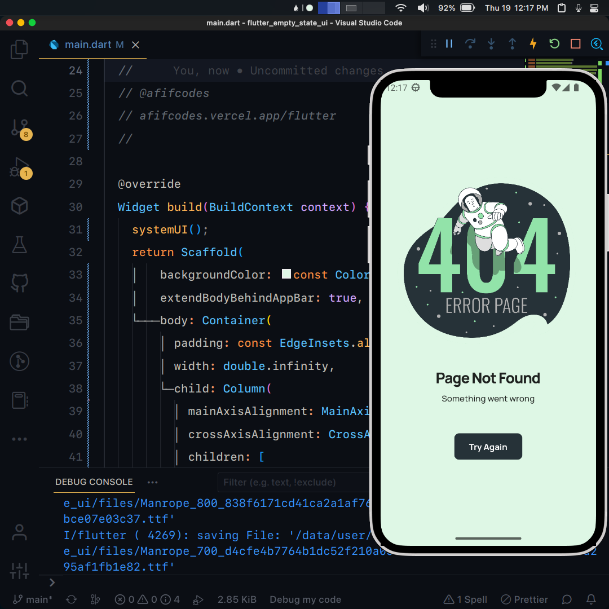

## Flutter UI - Empty State

```dart
void main() => runApp(MaterialApp(
      debugShowCheckedModeBanner: false,
      initialRoute: '/',
      onGenerateRoute: ((settings) {
        return RouteAnimation.slide(settings, const MyApp());
      }),
    ));
```

## Development Setup
```
git clone https://github.com/afifcodes/flutter-empty-state-ui.git
cd flutter-empty-state-ui
flutter pub get
flutter run
```

## Screenshots


## Links

* [Website](https://afifcodes.vercel.app/flutter)
* [Youtube channel](https://youtube.com/afifcodes)
* [Instagram](https://instagram.com/afifcodes)